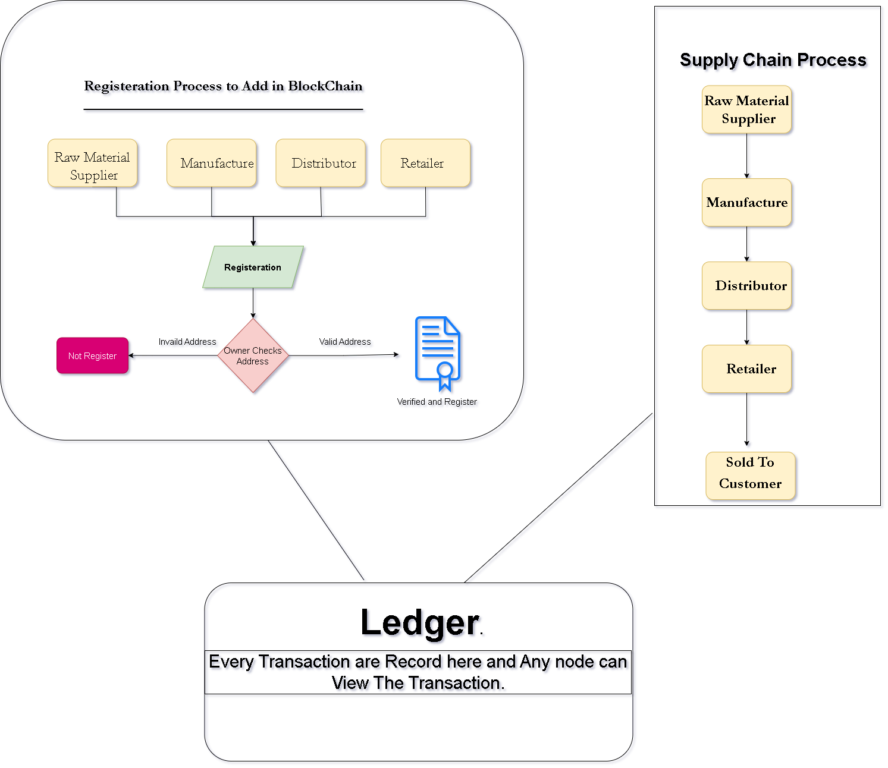

# Origin Chain

<p align="center">
  <a></a>
  <br>  
  Origin Chain
  <br>
</p>

<p align="center">
  <a href="https://docs.godechain.com/welcome/">
    
  </a>
  <a href="https://soliditylang.org/">
           
  </a>
  <a href="https://reactjs.org/">
    
  </a>
  <a href="https://www.trufflesuite.com/">
    
  </a>
  &nbsp;&nbsp;&nbsp;
  <a href="https://www.npmjs.com/package/web3">
    
  </a>
</p>

<h4 align="center">A Supply Chain Management System with <a href="https://docs.soliditylang.org/en/v0.8.4/" target="_blank">Solidity</a>.</h4>

<p align="center">
  <a>
    
  </a>
</p>

## Description

Origin Chain is a blockchain-based supply chain management system designed specifically for agricultural products, though it is adaptable to other types of supply chains. This system leverages smart contracts to ensure a transparent and secure transfer of products from the raw material supplier to the end customer. The use of blockchain technology reduces administrative overhead, increases transparency, and builds an efficient root of trust among all parties involved.

## Demo
https://github.com/user-attachments/assets/bdee9079-c81e-4346-b6fe-82a803012572

## Architecture

The smart contract is written in Solidity and is compiled, migrated, and deployed using Truffle.js on the Gode Testnet blockchain network. The frontend uses Web3.js to interact with the smart contract and the Gode Testnet blockchain network. MetaMask Wallet is used to perform transactions between each component in the supply chain.

## Supply Chain Flow


## Smart Contract Working Flow


This smart contract models various roles and stages involved in the supply chain of agricultural products:

- **Raw Material Supplier**: Provides the raw materials required for production.
- **Manufacturer**: Converts raw materials into finished products.
- **Distributor**: Distributes the products to retailers.
- **Retailer**: Sells the final products to customers.
- **Customer**: The end consumer of the products.

The contract owner deploys the contract and is responsible for authorizing various roles like retailer, manufacturer, etc. It stores information about the products, such as name, description, and current stage in the supply chain. Functions like `addRMS()`, `addManufacturer()`, `addDistributor()`, and `addRetailer()` are used by the contract owner to add new players to the supply chain, ensuring transparency and accountability.

### Registration Process to Add in Blockchain



1. **Registration**: The raw material supplier, manufacturer, distributor, and retailer register on the blockchain.
2. **Owner Verification**: The owner checks the addresses.
    - **Valid Address**: Verified and registered.
    - **Invalid Address**: Not registered.
3. **Ledger**: Every transaction is recorded in the ledger, and any node can view the transaction.

## Setting up Local Development

### Step 1: Installation and Setup

1. **VSCode**: Download from [here](https://code.visualstudio.com/).
2. **Node.js**: Download the latest version from [here](https://nodejs.org/) and check the version using terminal: `node -v`.
3. **Git**: Download the latest version from [here](https://git-scm.com/downloads) and check the version using terminal: `git --version`.
4. **Ganache**: Download the latest version from [here](https://www.trufflesuite.com/ganache).
5. **MetaMask**: Install as a browser extension from the Chrome Web Store or Firefox Add-ons store.

### Step 2: Create, Compile & Deploy Smart Contract

1. Open VSCode and open the terminal by pressing `Ctrl + '`.

2. Clone the project:
    ```sh
    git clone https://github.com/Mohit6304/OriginChain.git
    ```

3. Install Truffle globally:
    ```sh
    npm install -g truffle
    ```

4. Install dependencies:
    ```sh
    npm install
    ```

5. Compile the smart contract:
    ```sh
    truffle compile
    ```

6. Deploy the smart contract:
    - Open Ganache and create a new Workspace. Copy the RPC Server Address.
    - Add the RPC address in `truffle-config.js` and replace the host address and port address with your Ganache RPC.
    - Open terminal and run:
      ```sh
      truffle migrate
      ```

### Step 3: Run DAPP

1. Open a second terminal and enter the client folder:
    ```sh
    cd client
    ```

2. Install all packages in the `package.json` file:
    ```sh
    npm install
    ```

3. Install Web3:
    ```sh
    npm install --save web3
    ```

4. Run the app:
    ```sh
    npm start
    ```

    The app gets hosted by default at port 3000.

### Step 4: Connect MetaMask with Ganache

1. Start Ganache: Start the Ganache application and note the RPC server URL and port number.

2. Connect MetaMask: 
   - Open MetaMask in your browser and click on the network dropdown in the top-right corner.
   - Select "Custom RPC" and enter the RPC server URL and port number for your Ganache instance. Click "Save".

3. Import an account:
   - In Ganache, click on the "Accounts" tab and select the first account listed. Click on the "Copy" button next to the "Private Key" field to copy the private key.
   - In MetaMask, click on the three dots in the top-right corner, select "Import Account", and paste the private key into the private key field. Click "Import".

### License

This project uses an [MIT](https://opensource.org/licenses/MIT) license.

### Documentation

- [Solidity](https://docs.soliditylang.org/en/v0.8.4/)
- [React](https://reactjs.org/docs/getting-started.html)
- [Truffle](https://www.trufflesuite.com/docs/truffle/reference/configuration)
- [Ganache CLI](https://www.trufflesuite.com/docs/ganache/overview)
